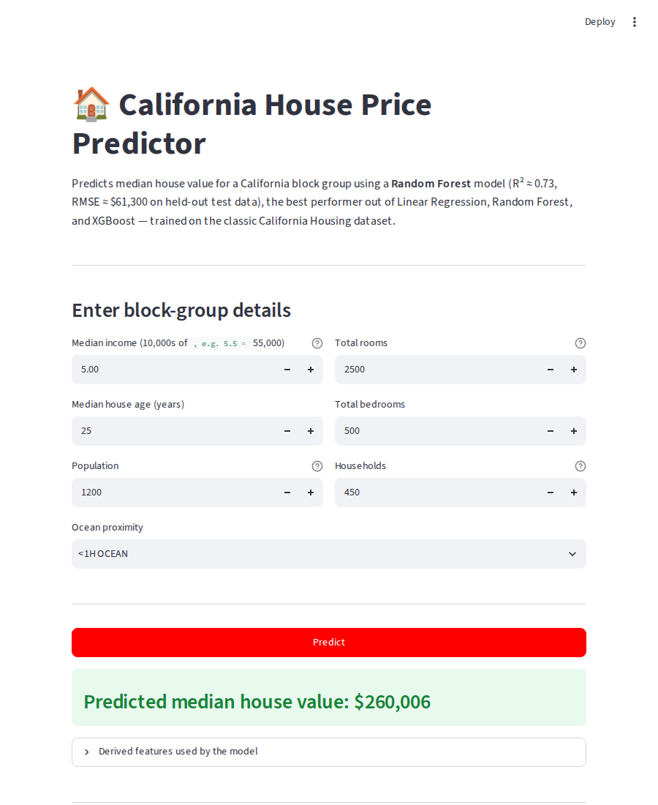

# Exercise 6 — Streamlit App: California House Price Predictor

**Neurofive Solutions ML Track**

A simple, shareable Streamlit app wrapping the best model from the earlier housing
regression exercises — turning a notebook result into something anyone can open in
a browser and use.

**Live app:** _add your Streamlit Community Cloud / Hugging Face Spaces URL here
after deploying (see below)._



## Model

The app loads `model/house_price_best_pipeline.joblib` — a scikit-learn `Pipeline`
(`StandardScaler` + `OneHotEncoder` → `RandomForestRegressor`) trained on the
California Housing dataset in the earlier `house_price_ensembles.ipynb` exercise.
It was picked automatically as the best of three models compared on held-out test
data:

| Model | RMSE ($) | R² |
|---|---|---|
| Linear Regression | 70,306 | 0.6385 |
| **Random Forest** | **61,318** | **0.7251** |
| XGBoost | 63,468 | 0.7054 |

## What the app does

- Takes 6 raw inputs a user would actually know about a neighborhood/block group:
  median income, house age, total rooms, total bedrooms, population, and households
- Derives the same 2 engineered features the model was trained on
  (`rooms_per_household`, `bedrooms_per_room`) behind the scenes
- Feeds everything through the saved pipeline (same scaling + encoding used in
  training, so there's no train/serve skew) and displays the predicted median house
  value

## Run it locally

```bash
pip install -r requirements.txt
streamlit run app.py
```

Then open the local URL Streamlit prints (usually `http://localhost:8501`).

## Deploy for free (Streamlit Community Cloud)

1. Push this folder (`app.py`, `requirements.txt`, `model/`) to a public GitHub repo
   — this one (`neurofive-ml-track`) works fine as a subfolder.
2. Go to [share.streamlit.io](https://share.streamlit.io), sign in with GitHub.
3. Click **"New app"**, pick this repo/branch, and set the main file path to
   `exercise6-streamlit-app/app.py`.
4. Click **Deploy** — first build takes a couple of minutes since it installs
   scikit-learn etc. from `requirements.txt`.
5. Copy the live `*.streamlit.app` URL it gives you and paste it at the top of this
   README (and the main repo README).

**Alternative — Hugging Face Spaces:** create a new Space, choose the **Streamlit**
SDK, and push these same files (HF Spaces expects `app.py` at the Space root, so the
model path in `app.py` and this folder structure may need to move up one level).

## Files

- `app.py` — the Streamlit app
- `model/house_price_best_pipeline.joblib` — the saved Random Forest pipeline (~58 MB)
- `requirements.txt` — pinned dependencies for a reproducible deploy
- `app_screenshot_empty.png`, `app_screenshot_prediction.png` — app screenshots

## Note on this session

The model file, the comparison table above, and the engineered-feature formulas all
came from your uploaded `house_price_ensembles.ipynb` / `house_price_pipeline.ipynb`
notebooks and `.joblib` files — the app was verified against the real saved pipeline
(loaded and test-predicted successfully) rather than rebuilt from scratch.

Deploying to Streamlit Community Cloud or Hugging Face Spaces requires a live account
login, which isn't something that can be done from this environment — steps above are
ready to follow directly. Once deployed, add the live link here and in the main repo
README, then record the LinkedIn demo video tagging Neurofive Solutions.
